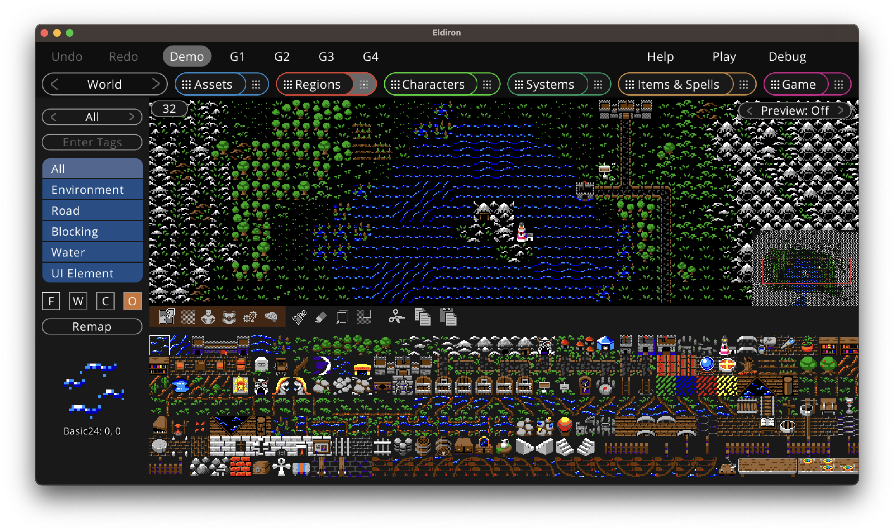

Eldiron is a cross-platform creator for classic role-playing-games (RPGs). It’s main aim is to create games similar to the RPGs of the 80’s and 90’s but with modern features as well as support for single and multi-player experiences.

Eldiron is currently under active development and a v1 is planned for 2023. Eldiron is open source and licensed under the MIT.

**The documentation for Eldiron is currently under development on this site**




## Features of v1

* Support games similar to Ultima 4 / 5 or any game which uses a rectangular grid layout.
* Either render tiles directly or in 2.5D using the built in [raycaster](https://github.com/markusmoenig/Raycaster). Games can switch between the two modes at runtime or display both at the same time (for example use the tiles view as a mini-map).
* Eldiron comes with integrated tile-maps or your can use your own square tiles with up to four levels of transparency.
* Single-player or multi-player experiences. Eldiron has a sophisticated multi-threaded server architecture to allow for as many player or NPC characters as possible.
* Procedural dungeons and regions using a dedicated node system.
* Cross platform. Eldiron is written in Rust and can nearly run everywhere, i.e. on the Web, macOS, Windows, Linux, iOS, Android etc. Eldiron Creator can run on any desktop.
* A sophisticated behavior node graph makes creation of AI behavior for NPCs easy. The node system is backed by a full-featured scripting language.
* Eldiron Creator has editors for tile-maps, regions and node based graphs for character behavior, systems (like crafting), items and the overall game logic.

Retro top-down and isometric perspectives as well as low-poly meshes will be supported post v1.

## Goals

* Being able to create games similar to the RPGs of the 80's and 90's.
* Support single-player or multi-player games and even MMOs.
* Over time support more perspectives like top-down and isometric.

## Installation

You can download the current pre-release in [Releases](https://github.com/markusmoenig/Eldiron/releases).

On macOS you can get access to the current Beta via a public [TestFlight Link](https://testflight.apple.com/join/50oZ5yds).

For ArchLinux users, simply add Eldiron from AUR:
```
yay -S eldiron-bin
```

Join the community on [Discord](https://discord.gg/ZrNj6baSZU) to get in contact.

## Supporting Eldiron

You can support the Eldiron project by becoming a [Patreon](https://patreon.com/eldiron) or a [GitHub Sponsor](https://github.com/sponsors/markusmoenig).

## License

The source and all assets I commissioned for Eldiron are licensed under the MIT.

Unless explicitly stated otherwise, any contribution intentionally submitted for inclusion in Eldiron, shall be MIT licensed as above, without any additional terms or conditions.

# Sponsors

None yet